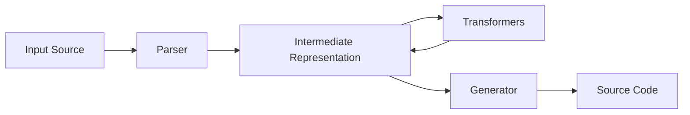

# UniStructGen (Universal Struct Generator)

> NOTE: This README is archived. See `README.md` for the current documentation.

[](https://www.rust-lang.org)
[](LICENSE-MIT)
[]()

**Type-safe code generation from any schema.**

UniStructGen is a powerful, pipeline-based code generation engine designed to convert various data formats (JSON, OpenAPI, and more) into type-safe Rust structures and client libraries. It goes beyond simple translation by employing smart type inference, customizable pipelines, and a centralized schema registry.

---

## 🚀 Key Features

*   **Pipeline Architecture**: Modular design where Parsers, Transformers, and Generators can be chained together.
*   **Smart JSON Inference**:
    *   Automatically detects complex types like `UUID`, `DateTime` (ISO 8601), and `Url`.
    *   Recursively handles nested objects, generating separate named structs.
    *   Sanitizes field names (e.g., `camelCase` to `snake_case`) while preserving serialization mappings.
*   **OpenAPI Client Generator**:
    *   Generates production-ready, async Rust clients from OpenAPI 3.0 specs.
    *   Includes request/response validation, error handling, and `tokio` support.
    *   Scaffolds a complete crate structure (`Cargo.toml`, `lib.rs`, examples).
*   **Markdown Parser**:
    *   Extracts struct definitions from documentation tables.
    *   Identifies field names, types, descriptions, and required/optional status.
*   **Schema Registry**: A centralized server to manage, version, and diff schemas across teams.
*   **Extensible IR**: Uses a robust Intermediate Representation (IR) that allows for easy addition of new parsers and generators.

---

## 📦 Installation

```bash
# Install the CLI tool
cargo install --path cli

# Or build from source
git clone https://github.com/maxBogovick/unistructgen
cd unistructgen
cargo build --release
```

---

## 🛠️ CLI Usage

UniStructGen provides two main workflows: simple struct generation and full client generation.

### 1. Generate Structs (`generate`)

Quickly convert a data file into Rust code.

```bash
# Generate Rust structs from a JSON file
unistructgen generate \
  --input examples/user.json \
  --output src/models.rs \
  --name User \
  --serde \
  --default

# Make all fields optional (useful for patch requests)
unistructgen generate --input data.json --optional
```

**Supported Options:**
*   `--input` / `-i`: Path to the input file.
*   `--output` / `-o`: Output path (prints to stdout if omitted).
*   `--format`: Force format (`json`, `markdown`). *Note: `sql` is currently in roadmap.*
*   --name`: Name of the root struct.
*   `--serde`: Derive `Serialize` and `Deserialize`.
*   `--default`: Derive `Default`.

### 2. Generate API Client (`client`)

Scaffold a full Rust library for an API.

```bash
# Generate a GitHub client from an OpenAPI spec
unistructgen client \
  --spec examples/github-client/github-api.yaml \
  --output ./my-github-client \
  --name "GitHub" \
  --examples true
```

**What gets generated?**
*   `src/types.rs`: All data models with validation attributes.
*   `src/client.rs`: Async HTTP client with methods typed to your API.
*   `src/lib.rs`: Library entry point.
*   `Cargo.toml`: Dependencies (reqwest, serde, tokio, etc.).
*   `README.md`: customized documentation for the generated client.
*   `examples/`: Runnable usage examples.

---

## 📚 Library Usage

You can embed UniStructGen directly into your Rust projects using the Core API.

```rust
use unistructgen_core::{Pipeline, PipelineBuilder};
use unistructgen_json_parser::{JsonParser, ParserOptions};
use unistructgen_codegen::{RustRenderer, RenderOptions};

fn main() -> anyhow::Result<()> {
    // 1. Configure Parser
    let parser = JsonParser::new(ParserOptions {
        struct_name: "Config".to_string(),
        derive_serde: true,
        ..Default::default()
    });

    // 2. Configure Generator
    let generator = RustRenderer::new(RenderOptions::default());

    // 3. Build & Execute Pipeline
    let mut pipeline = Pipeline::new(parser, generator);
    
    let json_input = r###"{"host": "localhost", "port": 8080}"###;
    let rust_code = pipeline.execute(json_input)?;

    println!("{}", rust_code);
    Ok(())
}
```

---

## 🏛️ Schema Registry

UniStructGen includes a **Schema Registry** service for teams that need to manage schema evolution.

### Server
The registry server is built with `Axum` and `PostgreSQL`.

```bash
# Start the registry server
cd schema-registry
cargo run --bin server
```

**API Endpoints:**
*   `GET /api/schemas`: List all schemas.
*   `POST /api/schemas`: Register a new schema.
*   `GET /api/schemas/:name/versions`: See history.
*   `POST /api/diff/:name`: Compare schema versions to check for breaking changes.
*   `POST /api/generate`: Generate code remotely.

### Registry CLI
Interact with the registry using the CLI tools:

```bash
# Upload a schema version
unistructgen-registry upload --file api-v1.json --name "payment-service"

# Check diff between versions
unistructgen-registry diff --name "payment-service" --v1 1.0 --v2 1.1

# Get stats
unistructgen-registry stats
```

---

## 🏗️ Architecture

The system follows a strict pipeline:



1.  **Parser**: Converts raw input (JSON, YAML) into `IRModule`. Smart inference happens here.
2.  **IR**: A language-agnostic representation of structs, enums, fields, and types (`Primitive`, `Option`, `Vec`, `Map`).
3.  **Transformer**: Optional passes to modify the IR (e.g., adding doc comments, renaming fields, relaxing constraints).
4.  **Generator**: Converts IR into target language strings.

---

## 🔮 Roadmap

*   [ ] **SQL Parser**: Generate structs from `CREATE TABLE` statements.
*   [ ] **Python/TypeScript Generators**: Expand support beyond Rust.
*   [ ] **Remote Fetching**: Support `http(s)` URLs directly in the generic `generate` command.

---

## 📄 License

This project is licensed under either of

*   Apache License, Version 2.0, ([LICENSE-APACHE](LICENSE-APACHE) or http://www.apache.org/licenses/LICENSE-2.0)
*   MIT license ([LICENSE-MIT](LICENSE-MIT) or http://opensource.org/licenses/MIT)

at your option.
# NOTE: This README is archived. See README.md for the current documentation.
